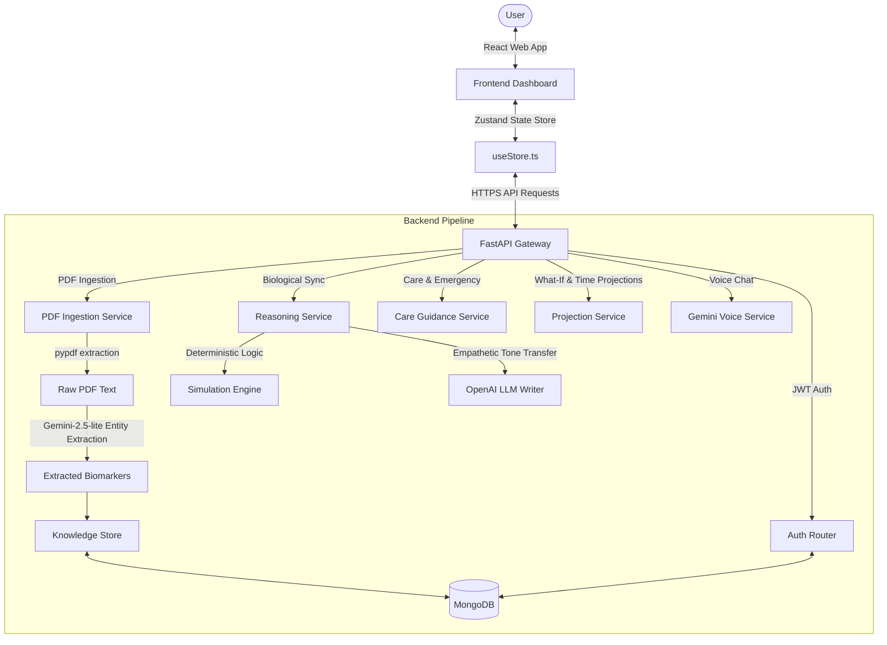

# Aura Health: Digital Twin AI - Comprehensive Architecture & Implementation Specifications

Welcome to the comprehensive technical documentation for **Aura Health**, a high-fidelity "Digital Twin" simulator that bridges the gap between raw medical reports (PDF scans) and real-time actionable health projections. This document serves as a detailed code-level breakdown, structural walkthrough, and mathematical analysis of the entire application.

---

## 🏗️ System Architecture Overview

The system is built on a **Hybrid Intelligence Framework**, integrating a deterministic physiological simulation engine with probabilistic AI agents for medical reasoning, RAG (Retrieval-Augmented Generation), and interactive voice consultation.

---

## 📂 File-by-File Code Walkthrough

### 1. Root Level & Technical Specifications
* **[AURA_HEALTH_TECHNICAL_SPEC.txt](file:///C:/Users/palar/OneDrive/Documents/digital-twin-health-ai/AURA_HEALTH_TECHNICAL_SPEC.txt)**: Core architectural blueprint detailing the "Bio-Reasoning" pipeline, clinical formulas, WHO IPCHS medical guardrails, and system boundaries.
* **[component_briefing.txt](file:///C:/Users/palar/OneDrive/Documents/digital-twin-health-ai/component_briefing.txt)**: A high-level description mapping every folder/component in both frontend and backend to its corresponding functional responsibilities.
* **[system_logic_walkthrough.txt](file:///C:/Users/palar/OneDrive/Documents/digital-twin-health-ai/system_logic_walkthrough.txt)**: Summary of the numerical calculation scales, health grades ($A$-$F$), 3D pulse math formulas, and core UI/UX dark-theme styling parameters.
* **[working_theory.txt](file:///C:/Users/palar/OneDrive/Documents/digital-twin-health-ai/working_theory.txt)**: The scientific basis and mathematical formulas defining health decay constants, RAG segmentation, Zero-shot Named Entity Recognition (NER) for medical tables, and stabilization guidelines.

---

### 2. Backend Implementation (FastAPI)

The FastAPI server acts as the orchestration gateway, handling clinical validation, AI pipelines, database persistence, and external service calls.

#### ⚙️ Gateway & API Interfaces
* **[api.py](file:///C:/Users/palar/OneDrive/Documents/digital-twin-health-ai/backend/app/api.py)**:
  - Initializes FastAPI application, handles CORS for local/production servers, and lazily mounts repositories.
  - Defines Pydantic request/response structures for `GenerateHealthReportRequest`, `CareGuidanceRequest`, `HealthProjectionRequest`, and `VoiceConsultRequest`.
  - Exposes the `/v1/doctors` route, querying the Google Places API via RapidAPI to recommend specialized local hospitals based on the user's highest-risk organs and location.
* **[api/index.py](file:///C:/Users/palar/OneDrive/Documents/digital-twin-health-ai/api/index.py)**: Serverless function wrapper serving the FastAPI application in Vercel serverless environments.

#### 🧠 Reasoning & Simulation Engine
* **[service.py](file:///C:/Users/palar/OneDrive/Documents/digital-twin-health-ai/backend/app/reasoning_engine/service.py)**:
  - Manages `HealthReportService`. Coordinates the run flow.
  - Generates the deterministic grounded report first, and if `llm` mode is active, triggers `OpenAIResponsesWriter` to layer empathetic, clinical summaries and causal narratives over the mathematical organ metrics.
  - Performs strict post-validation checking of the final merged object against the Pydantic model.
* **[engine.py](file:///C:/Users/palar/OneDrive/Documents/digital-twin-health-ai/backend/app/reasoning_engine/engine.py)**:
  - The deterministic mathematical simulation pipeline.
  - Computes organ scores based on weighted risk state vectors (BMI, smoking, sleep, diet, active levels, and alcohol units).
  - Handles localization mapping (English, Hindi, Telugu) for summaries, risk labels, factors, action points, and "What-If" habit adjustments.
* **[models.py](file:///C:/Users/palar/OneDrive/Documents/digital-twin-health-ai/backend/app/reasoning_engine/models.py)**: Defines runtime domain dataclasses (`UserProfile`, `OrganScore`, `WhatIfDelta`, `ReportRequest`) and custom input validator guards checking range constraints (e.g., age within $0$-$120$, organ scores within $0$-$100$).
* **[report_schema.py](file:///C:/Users/palar/OneDrive/Documents/digital-twin-health-ai/backend/app/reasoning_engine/report_schema.py)**: Contains Pydantic models for output validation (`OrganInsightModel`, `HealthReportModel`) and raw JSON schema declarations mapping structure requirements for external parser safety.
* **[llm_writer.py](file:///C:/Users/palar/OneDrive/Documents/digital-twin-health-ai/backend/app/reasoning_engine/llm_writer.py)**: Adapts OpenAI-compatible endpoints to rewrite raw, mechanical clinical summaries into empathetic health-coaching insights.
* **[care_guidance.py](file:///C:/Users/palar/OneDrive/Documents/digital-twin-health-ai/backend/app/reasoning_engine/care_guidance.py)**: Generates safe, temporary, non-clinical immediate actions and caution flags when user symptoms or high organ risk anomalies emerge.
* **[projection.py](file:///C:/Users/palar/OneDrive/Documents/digital-twin-health-ai/backend/app/reasoning_engine/projection.py)**: Generates progressive 2-year forecasts over multiple intervals (Now, 6M, 1Y, 2Y) predicting physiological changes depending on lifestyle.
* **[gemini_service.py](file:///C:/Users/palar/OneDrive/Documents/digital-twin-health-ai/backend/app/reasoning_engine/gemini_service.py)**: Powers the conversational AI consultant (`GeminiVoiceService`) using `gemini-2.5-flash-lite`. Automatically formats the user's current 3D health twin matrix and conversation logs into voice-ready responses in the user's language.

#### 📄 PDF Parsing & RAG Store
* **[service.py (PDF Ingest)](file:///C:/Users/palar/OneDrive/Documents/digital-twin-health-ai/backend/app/pdf_ingestion/service.py)**:
  - Extracts raw characters from multi-page medical reports via `pypdf.PdfReader`.
  - Uses `gemini-2.5-flash-lite` to extract key biomarkers (HbA1c, Fasting Glucose, Creatinine, eGFR, ALT, AST, BP, etc.) and parses them into a structured JSON output.
* **[store.py](file:///C:/Users/palar/OneDrive/Documents/digital-twin-health-ai/backend/app/knowledge_store/store.py)**: Converts ingested medical texts and health guideline documents into overlapping chunks (default: 600 characters) and inserts them into the document repository.

#### 💾 Database & Authentication
* **[database.py](file:///C:/Users/palar/OneDrive/Documents/digital-twin-health-ai/backend/app/storage/database.py)**: Establishes connections to MongoDB. Automates text indexing on `title` and `content` fields. Provides local development fallback when MongoDB instance is offline.
* **[repositories.py](file:///C:/Users/palar/OneDrive/Documents/digital-twin-health-ai/backend/app/storage/repositories.py)**:
  - Encapsulates database actions for collections: `reports`, `telemetry_events`, `documents`, `document_chunks`, and `users`.
  - Provides fallback text search using simple regular expressions when native MongoDB Atlas Full-Text Indexing is unavailable.
* **[router.py (Auth)](file:///C:/Users/palar/OneDrive/Documents/digital-twin-health-ai/backend/app/auth/router.py)**: Exposes endpoints for registering new profiles, generating JWT tokens, fetching session identity (`/me`), and updating profile habits.

---

### 3. Frontend Implementation (React & TypeScript)

The frontend is a futuristic, highly responsive single-page dashboard optimized for diagnostic visualization.

#### ⚡ State Architecture
* **[useStore.ts](file:///C:/Users/palar/OneDrive/Documents/digital-twin-health-ai/frontend/aura-health/src/store/useStore.ts)**:
  - The central state engine utilizing `zustand`.
  - Synchronizes user metrics, simulated parameters, and PDF analysis records.
  - Manages loading thresholds and triggers backend fetches: `runSimulation`, `analyzeReport`, `fetchDoctors`, `fetchGuidance`, `fetchHealthProjection`, and `sendVoiceConsult`.

#### 🎨 Components & Dashboard Widgets
* **[HumanAnatomy.tsx](file:///C:/Users/palar/OneDrive/Documents/digital-twin-health-ai/frontend/aura-health/src/components/BodySimulator/HumanAnatomy.tsx)**:
  - Implements the 3D anatomical viewer using React Three Fiber.
  - Binds the 5 organ meshes to the Zustand score store.
  - Renders custom glowing shader materials where the pulsative rate and glow intensity dynamically reflect organ-specific stress levels.
* **[ReportAnalyzer.tsx](file:///C:/Users/palar/OneDrive/Documents/digital-twin-health-ai/frontend/aura-health/src/components/ReportAnalyzer.tsx)**: Handles PDF drag-and-drop ingestion. Displays extraction progress status (e.g., "Extracting biological markers...") and visualizes output metrics side-by-side with normal clinical ranges.
* **[CareGuidance.tsx](file:///C:/Users/palar/OneDrive/Documents/digital-twin-health-ai/frontend/aura-health/src/components/CareGuidance.tsx)** & **[CareChat.tsx](file:///C:/Users/palar/OneDrive/Documents/digital-twin-health-ai/frontend/aura-health/src/components/CareChat.tsx)**: Provide immediate preventive checklists and direct conversational search boxes for self-care advice.
* **[FutureProjection.tsx](file:///C:/Users/palar/OneDrive/Documents/digital-twin-health-ai/frontend/aura-health/src/components/FutureProjection.tsx)**: Visualizes the 2-year organ projections on a responsive multi-line area chart using Recharts.
* **[DoctorRecommendations.tsx](file:///C:/Users/palar/OneDrive/Documents/digital-twin-health-ai/frontend/aura-health/src/components/DoctorRecommendations.tsx)**: Displays a list of recommended local specialists, complete with star ratings, clinical tier labels (Tiers 1-3 based on user rating thresholds), phone numbers, and direct Google Maps links.
* **[VoiceInteraction.tsx](file:///C:/Users/palar/OneDrive/Documents/digital-twin-health-ai/frontend/aura-health/src/components/VoiceInteraction.tsx)**: Provides a holographic, circular console interface representing the Gemini Voice Consult. Demonstrates a pulse wave animation synced to AI speech states.
* **[OrganCard.tsx](file:///C:/Users/palar/OneDrive/Documents/digital-twin-health-ai/frontend/aura-health/src/components/OrganCard.tsx)** & **[OrganRiskList.tsx](file:///C:/Users/palar/OneDrive/Documents/digital-twin-health-ai/frontend/aura-health/src/components/OrganRiskList.tsx)**: Render individual organ modules, highlighting academic health grades ($A$-$F$) and top risk drivers.
* **[ControlPanel.tsx](file:///C:/Users/palar/OneDrive/Documents/digital-twin-health-ai/frontend/aura-health/src/components/ControlPanel.tsx)**: Renders range sliders and switches allowing users to manipulate lifestyle factors (age, BMI, sleep hours, activity level, diet quality, smoking, and drinking status) to trigger instantaneous 3D twin updates.

---

## 🧮 Mathematical Formulations & Physiological Logic

Aura Health's simulation engine uses deterministic physiological formulas to calculate organ risk profiles, matching them against standard clinical scales:

### 1. Physiological Risk Formulations

$$\text{Risk}_{\text{Organ}} \in [0, 100]$$

#### 🩸 Cardiac Risk (Heart)
Cardiac stress calculates systemic arterial strain and metabolic loads over age constants, subtracting sleep recoveries:
$$\text{Stress}_{\text{Cardiac}} = (\text{Age} \times 0.3) + (\text{BMI} \times 1.5) + (20 \text{ if Smoker}) + (\text{Alcohol Units} \times 0.5) - (\text{Sleep Hours} \times 2.0)$$
$$\text{Risk}_{\text{Cardiac}} = \max(5.0, \text{Stress}_{\text{Cardiac}} - 15)$$

#### 🫁 Pulmonary Risk (Lungs)
Pulmonary score scales rapidly with active smoking status due to chronic alveolar exposure, adjusted by systemic active recovery weights:
$$\text{Stress}_{\text{Pulmonary}} = 20.0 + (45.0 \text{ if Smoker}) + (\text{BMI} \times 0.5) + (\text{Age} \times 0.1) + (10.0 \text{ if Activity is Low})$$

#### 🍺 Hepatic Risk (Liver)
Hepatic stress scales directly with weekly alcohol clearance units (heavily weighted) and fatty metabolic deposits (BMI):
$$\text{Stress}_{\text{Hepatic}} = 15.0 + (\text{Alcohol Units} \times 2.5) + (\text{BMI} \times 1.0) + (5.0 \text{ if Smoker})$$

#### ⚗️ Renal Risk (Kidneys)
Renal scoring factors in filtration pressure stresses (BMI-linked hypertension pathways) and diet-derived salt/protein loads:
$$\text{Stress}_{\text{Renal}} = 15.0 + (\text{BMI} \times 1.5) + (10.0 \text{ if Smoker}) + (15.0 \text{ if Diet is Unhealthy})$$

#### 🧠 Cerebral Risk (Brain)
Cerebral risk models neural recovery cycles (sleep hours) balanced against systemic age-related decline, metabolic parameters, and direct neurotoxic factors:
$$\text{Stress}_{\text{Cerebral}} = 25.0 - (\text{Sleep Hours} \times 2.5) + (\text{Age} \times 0.4) + (15.0 \text{ if Activity is Low}) + (15.0 \text{ if Alcohol Units} > 14)$$
$$\text{Risk}_{\text{Cerebral}} = \text{Stress}_{\text{Cerebral}} + 15$$

---

### 2. Vitality Index & Health Grading

The **Vitality Index** ($V$) represents the user's remaining clinical capacity. It acts as the inverse of the highest organ risk score:

$$V = 100 - \max_{o \in \text{Organs}}(\text{Risk}_o)$$

The dashboard translates this capacity value into Academic Health Grades:

| Score Range | Grade | Description |
| :--- | :---: | :--- |
| $90 \le V \le 100$ | **A+ / A** | Exceptional / Optimal health snapshot. |
| $80 \le V < 90$ | **B** | Stable. Minimal organ stress. |
| $70 \le V < 80$ | **C** | Fair. Actionable lifestyle changes needed. |
| $60 \le V < 70$ | **D** | Warning. High systemic organ stress. |
| $V < 60$ | **F** | Critical. Intervention and clinical consult advised. |

---

### 3. Holographic 3D Pulsation Frequencies

The 3D anatomical viewer indicates organ stress visually using emissive pulse rates. The emissive glow cycles at a frequency proportional to the calculated risk:

$$\text{Frequency (Hz)} = 0.5 + \frac{\text{Risk}_{\text{Organ}}}{10}$$

* **Low Risk ($10\%$)**: $\approx 1.5\text{ Hz}$ (A slow, calm biological glow)
* **Critical Risk ($90\%$)**: $\approx 9.5\text{ Hz}$ (A rapid, throbbing warning signal)

---

### 4. Health Projection Curves

To model the "Cost of Inaction," the projection engine projects how the baseline Vitality Index decays over a 2-year timeline when unhealthy habits persist:

$$S(t) = S_{\text{initial}} \times e^{-k \cdot \text{Age Factor} \cdot t}$$

Where:
* $S_{\text{initial}}$ is the starting Vitality Index.
* $k$ is the lifestyle decay coefficient (augmented by active smoking, high alcohol usage, and sedentary activity).
* $t$ represents time elapsed in years.

---

## ⚕️ WHO Guardrails & Care Standardization

Aura Health incorporates the World Health Organization (WHO) framework for **Integrated People-Centred Health Services** (IPCHS):

1. **Self-Care & Stabilization Protocol**:
   - The `care_guidance` engine uses systemic prompts enforcing non-prescription verbs (e.g., *Ensure*, *Maintain*, *Rest*, *Observe*) rather than therapeutic directives (e.g., *Take*, *Dose*, *Inject*).
   - Prevents AI hallucination of medication dosages, maintaining strict compliance boundaries.
2. **Preventive Alert Thresholds**:
   - Extraction markers dynamically flag warning alerts based on global standards (e.g., Fasting Glucose $>126\text{ mg/dL}$ or $\text{HbA1c} > 6.5\%$ trigger high-risk diabetic alerts).
3. **Multilingual Access Integration**:
   - Full localization in **Hindi (हिन्दी)** and **Telugu (తెలుగు)** ensures high-fidelity self-care details are accessible to diverse populations.

---

**Aura Health: Digital Twin AI** — *Translating clinical complexity into intuitive biological visual representations.*
